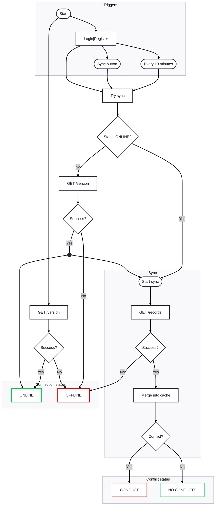

# GophKeeper Password Manager

GophKeeper is a secure client-server application designed to store sensitive information such as logins, passwords, binary data, and other private records. It ensures data consistency across multiple devices through synchronization and protects user information with robust end-to-end encryption.

---

## System Architecture

- **Communication:** HTTP(S)
- **Authentication:** JSON Web Tokens (JWT) with HS256 algorithm
- **Server Storage:** PostgreSQL
  - **Database Schema:**
    - **`users` table:** Stores user details including a unique ID (UUID), login, password hash (Argon2id), and creation timestamp.
    - **`records` table:** Holds encrypted user records with fields for record ID (UUID), user ID (foreign key), data type (enum: `credentials`, `text`, `binary`, `card`), encrypted data and nonce (bytea), metadata (JSONB), and version number (integer for synchronization tracking). Uses composite primary key: id + user_id.
- **Client Storage:** BadgerDB (local key-value database for caching records)
- **Encryption:**
  - End-to-end AES-256-GCM encryption
  - Client-side Argon2id key derivation
  - Irrecoverable master password (no reset mechanism)

---

## Client Application

The client is a cross-platform command-line interface (CLI) application built with the BubbleTea TUI framework, supporting Windows, Linux, and macOS. Configuration is stored in OS-specific paths:

- **Linux:** `~/.config/GophKeeper/config.toml`
- **macOS:** `~/Library/Application Support/GophKeeper/config.toml`
- **Windows:** `%APPDATA%\GophKeeper\config.toml`

If the configuration file is missing at startup, it is automatically created with the default server address: `http://localhost:8080`.

### Initial Menu:
- **Login:** Authenticate with an existing account.
- **Register:** Create a new account.
- **About:** View client and server version/build information.

### Authenticated Menu:
- **Show:** Display stored records.
- **Add:** Create a new record.
- **Sync:** Manually initiate synchronization.
- **About:** View client and server version/build information.

---

## Registration

**Endpoint:** `POST /register`

User registers with login (any string, no email verification) and master password.

**Server:**
1. Checks if the `login` is unique.
2. Generates a UUID and hashes the password with Argon2id.
3. Stores the user in the `users` table.
4. Returns a JWT token for authentication.

**Client:**
1. Derives an AES-256-GCM encryption key from the master password using Argon2id (salt = login + UUID).
2. Stores the key in memory for the session.

*Note: The master password is not stored and cannot be recovered. Losing it results in permanent data inaccessibility.*

---

## Authentication

**Endpoint:** `POST /login`

**Server:** Verifies credentials against Argon2id hash

**Client:** Identical key derivation as registration

---

## Synchronization

**Triggers:**
- Automatically after login/registration.
- In the background every 10 minutes.
- Manually via the "Sync" option.

**Process:**
1. Check server availability via `GET /version`
2. Pull server records via `GET /records` → merge into local BadgerDB
3. Push `pending` records via `PUT /records/{id}`
4. Update statuses (`synced`/`conflict`)
5. Delete `deleted` records via `DELETE /records/{id}`
6. Completely remove records marked `deleted` locally
7. Show message if has conflicts

---

## Viewing Records ("Show")

Displays all records stored in the local BadgerDB cache. User can select a record via the TUI to:
- View details
- Update
- Delete
- Resolve conflicts (if applicable)

---

## Adding and Updating Records

**Endpoint:** `PUT /records/{id}`

**Process:**
1. Select data type:
   - Credentials • Text • Binary • Bank card
2. Enter data + optional JSON metadata
3. Client:
   - Generates UUID (for new records)
   - Encrypts payload (AES-256-GCM)
   - Sends to server
4. Server stores record with a composite primary key (UUID + user ID)
5. Conflict handling triggers resolution UI

---

## Deleting Records

**Endpoint:** `DELETE /records/{id}`

**Process:**
1. Mark `deleted` locally
2. Send delete request
3. Remove from cache on success

---

## Conflict Resolution

**Detection:** Version mismatch during sync/update

**Resolution Workflow:**
1. Visual indicators:
   - Conflicted records are marked with `[CONFLICT]` flag in the `Show` list
   - Detailed conflict notification appears in the TUI interface
2. User selects conflicted record → "Resolve"
3. Side-by-side comparison:
   - Local version (client changes)
   - Remote version (server state)
4. User selects preferred version
5. Client:
   - Increments version number
   - Sends update via `PUT /records/{id}`
   - Updates status: `conflict` → `synced`

---

## System Information (`About`)

Displays build metadata:
- Client version/date
- Server version/date

---

## Synchronization diagram

